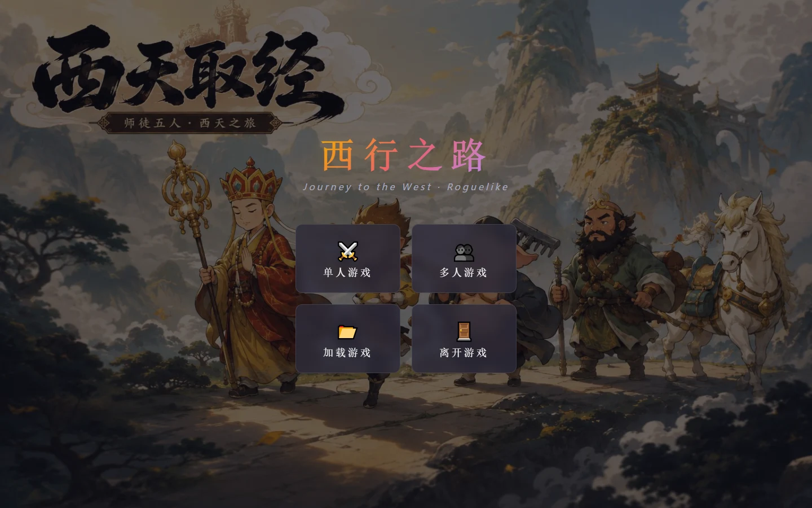
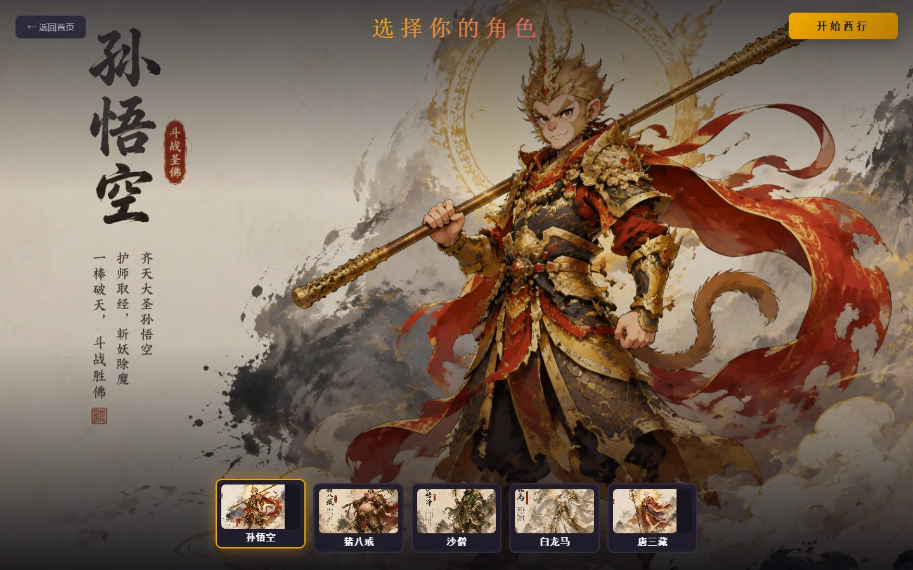
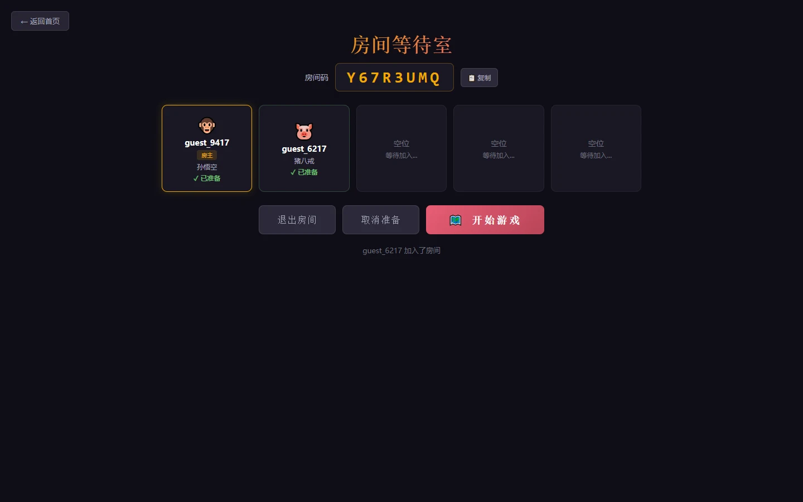
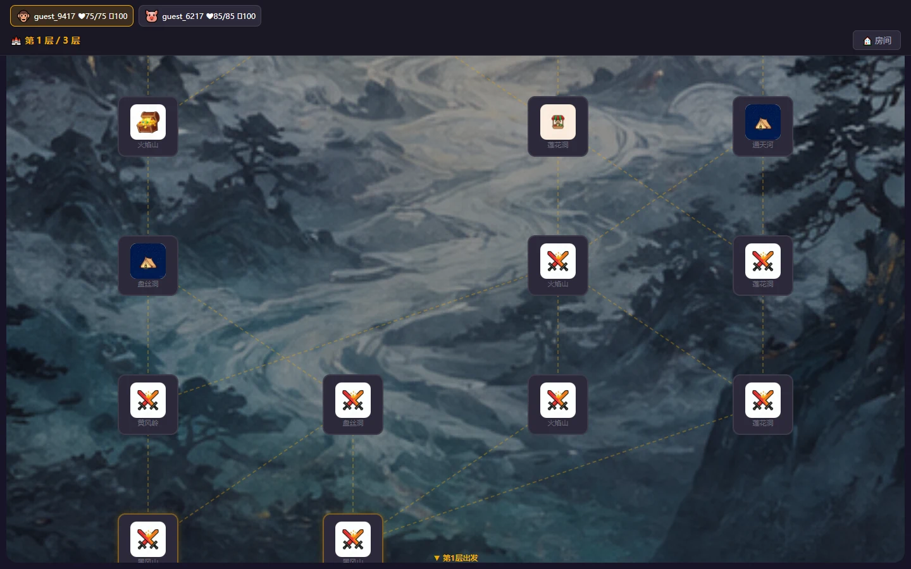
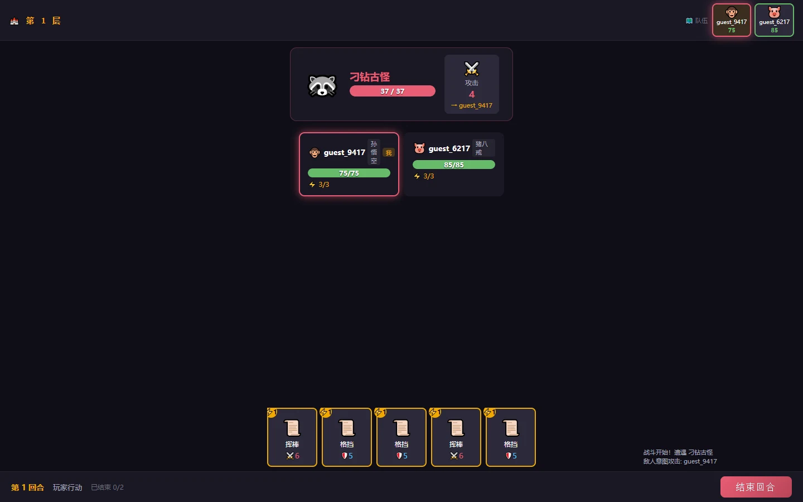
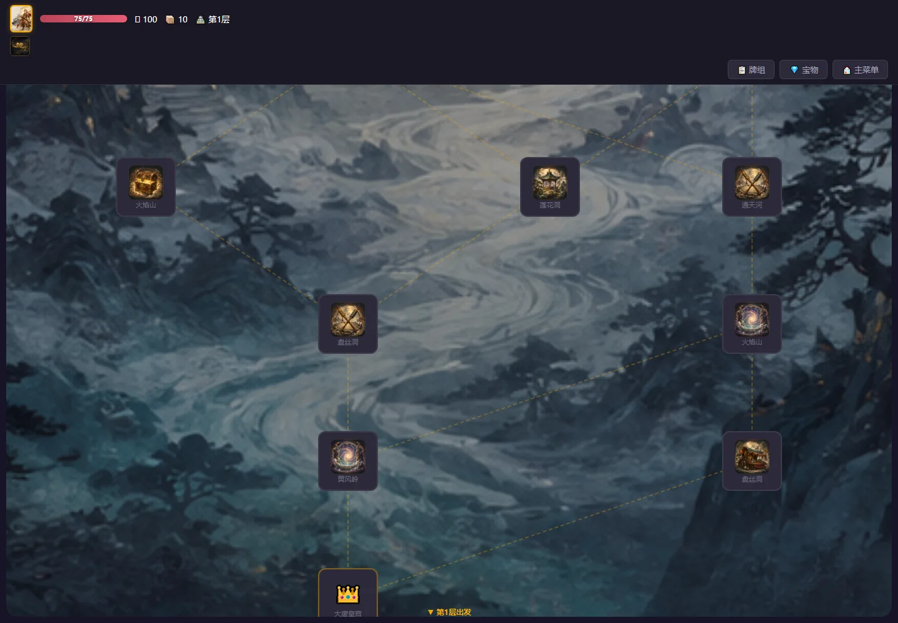
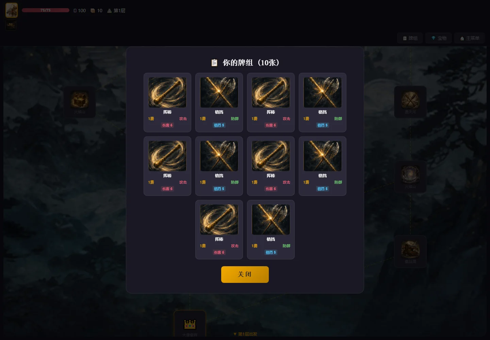
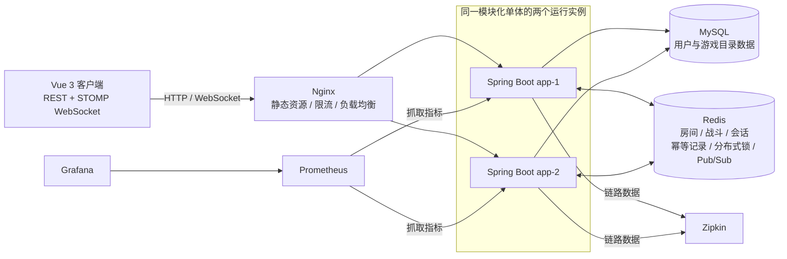

# 西游记：西行之路

[](https://github.com/mishen9998/xiyouji/actions/workflows/ci.yml?query=branch%3Acodex%2Fmultimodule-distributed)

基于 Spring Boot 3.4 与 Vue 3 的西游记 Roguelike 卡牌游戏，支持单人闯关和最多 5 人实时协作；后端采用五模块模块化单体，并完成 Redis 共享状态下的双实例一致性验证。

<p align="center">
  
</p>

> [!IMPORTANT]
> 本项目是模块化单体，不是微服务。`app-1` 与 `app-2` 是同一应用的两个运行实例，共享 MySQL 和 Redis，用于验证负载均衡、并发写入与跨实例实时通知。
>
> 项目采用 DDD 思想与模块化分层，但当前并非严格的纯领域架构：`domain` 仍使用 JPA/Jackson 注解，`application` 仍依赖 Spring、JWT 和 Jackson。相关解耦工作放在可运行性、测试和性能证据之后推进。

## 运行界面

以下图片均由当前 Docker 环境实测生成，而非概念图。

| 角色选择 | 双人房间 |
| --- | --- |
|  |  |

| 多人地图 | 多人战斗 |
| --- | --- |
|  |  |

| 新生成的地图节点插图 | 新生成的卡牌插图 |
| --- | --- |
|  |  |

插图生成范围、提示词规范与验证结果见 [生成式插图替换记录](docs/generated-artwork.md)。

当前尚未提供公网 Demo。启动本地环境后可访问：

- 游戏页面：<http://localhost:8080>
- Swagger UI：<http://localhost:8080/swagger-ui/index.html>
- 健康检查：<http://localhost:8080/actuator/health>

## 核心能力

### 游戏功能

- 单人 Roguelike 闯关：五种角色、随机地图、卡牌战斗、奖励选择、牌组调整和多层推进。
- 多人实时协作：房间创建/加入、唯一角色选择、准备状态、共享地图和多人战斗。
- 单个房间最多 5 人，服务端使用状态版本约束并发修改。
- 后端提供注册、登录和游客身份 API；当前前端默认自动获取游客 JWT。
- 前端通过 REST 获取权威状态，通过 STOMP WebSocket 接收实时变化通知。

### 工程能力

- Maven 五模块模块化单体，并使用 ArchUnit 持续检查关键依赖边界。
- Redis 保存房间、战斗和单人会话状态，为两个应用实例提供共享状态。
- Redisson 房间锁与会话锁串行化热点写入。
- 幂等键、请求指纹和状态版本共同处理网络重试、重复提交与并发覆盖。
- Redis Pub/Sub 负责跨实例事件通知；客户端断线后通过 REST 对账。
- Nginx 为两个 Spring Boot 实例提供 HTTP/WebSocket 负载均衡与基础限流。
- Actuator、Prometheus、Grafana 与 Zipkin 组成可观测性基线。
- 多阶段 Docker 构建和 Docker Compose 提供可复现的完整验收环境。

## 技术栈

| 领域 | 技术 |
| --- | --- |
| 后端 | Java 17、Spring Boot 3.4.1、Spring Security、Spring Data JPA、Spring WebSocket |
| 数据 | MySQL 8、Redis 7、Redisson、Flyway |
| 前端 | Vue 3、TypeScript、Pinia、Vue Router、Vite、Three.js、STOMP |
| 接口 | REST、WebSocket/STOMP、OpenAPI/Swagger |
| 可观测性 | Actuator、Micrometer、Prometheus、Grafana、Zipkin |
| 工程化 | Maven、Docker、Docker Compose、Nginx、GitHub Actions |
| 测试 | JUnit 5、Mockito、ArchUnit、Testcontainers、JaCoCo、Vitest、Playwright、Compose 黑盒 E2E |

## 运行架构



Redis 中保存权威运行状态。Pub/Sub 只传递“状态发生变化”的通知，不承担可靠消息队列职责；客户端重连后重新通过 REST 获取完整状态。

## 模块设计

```text
xiyouji-parent
├── xiyouji-common
├── xiyouji-domain
├── xiyouji-application
├── xiyouji-infrastructure
└── xiyouji-bootstrap
```

| 模块 | 主要职责 |
| --- | --- |
| `xiyouji-common` | 公共异常、错误码和共享类型 |
| `xiyouji-domain` | 游戏实体、值对象与核心规则 |
| `xiyouji-application` | 用例服务，以及 Repository、锁、状态存储和事件 Port |
| `xiyouji-infrastructure` | JPA、Redis、Redisson、Pub/Sub 等适配器实现 |
| `xiyouji-bootstrap` | Spring Boot 启动、Controller、安全配置和静态资源装配 |

总体依赖方向为：

```text
common ← domain ← application ← infrastructure ← bootstrap
```

当前使用 4 条 ArchUnit 规则检查：

- Controller 不直接依赖 Repository。
- Service 不反向依赖 Controller。
- 应用服务通过 Port 访问持久化能力。
- 游戏模型不依赖 Redis 或 Redisson。

这套结构用于控制模块边界，不表示当前已经实现完全框架无关的领域层。

## 关键技术难点与取舍

| 问题 | 当前方案 | 验证方式 | 取舍 |
| --- | --- | --- | --- |
| 请求可能落到不同实例 | Redis 保存房间、战斗和会话权威状态 | `app-1` 创建房间、`app-2` 加入并读取 | 增加 Redis 运行依赖，换取实例无关的状态访问 |
| 多个玩家并发修改同一房间 | Redisson 房间粒度锁、预期状态版本和版本递增 | 并发加入与状态冲突测试 | 热点房间写入被串行化，优先保证一致性 |
| 网络重试造成重复写入 | `X-Idempotency-Key`、请求指纹、执行状态和响应重放 | 幂等与命令守卫测试 | Redis 中保留短期幂等记录，需要额外存储空间 |
| Pub/Sub 不保证可靠送达 | 事件携带 `eventId/stateVersion`；客户端通过 REST 对账 | 跨实例 STOMP 黑盒 E2E | 接受短暂通知丢失，不把 Pub/Sub 当消息队列 |
| 模块边界随开发退化 | Maven 模块、Port/Adapter 和 ArchUnit 规则 | 4 条架构测试进入 Maven 验证 | 暂时保留部分框架耦合，后续逐步净化领域层 |
| 双实例故障难观察 | Actuator、Prometheus、Grafana、Zipkin 和告警规则 | 健康检查、`promtool` 与故障演练 | 当前是本地部署基线，不等同于生产监控体系 |

## 快速启动

### Windows 一键演示（推荐）

已安装 Docker Desktop 时，直接双击 [启动演示.bat](启动演示.bat)，或执行：

```powershell
powershell.exe -NoProfile -ExecutionPolicy Bypass -File .\scripts\demo.ps1 up
```

脚本会自动生成仅存在本机的随机密钥，启动 MySQL、Redis 和单实例应用，然后依次验证健康接口、前端首页、游客 JWT 以及单人会话的创建/回读/清理。任一环节失败都会返回非零状态并打印最近日志。

常用操作：

```powershell
.\scripts\demo.ps1 status  # 查看状态
.\scripts\demo.ps1 smoke   # 重跑业务验收
.\scripts\demo.ps1 logs    # 跟踪应用日志
.\scripts\demo.ps1 down    # 停止容器，保留数据卷
```

这条路径用于面试现场的快速启动与单人演示。双实例一致性与 WebSocket 黑盒验收使用下方完整环境。

### Docker 双实例完整验收环境

需要 Docker Desktop 或兼容的 Docker Engine。

Windows PowerShell：

```powershell
Copy-Item .env.example .env
```

Linux/macOS：

```bash
cp .env.example .env
```

编辑 `.env`，至少替换数据库密码、JWT 密钥和 Grafana 密码，然后启动：

```bash
docker compose up -d --build --wait
docker compose ps
```

首次构建和两个 JVM 冷启动可能需要数分钟。停止服务：

```bash
docker compose down
```

该命令默认保留数据卷。只有明确需要删除本地测试数据时才使用 `docker compose down -v`。

更新镜像并单独重建应用容器后，应同时重建 Nginx 以刷新上游解析：

```bash
docker compose up -d --force-recreate app-1 app-2 nginx
```

### Standalone 学习模式

Standalone 模式使用 H2、内存状态存储和 JVM 本地锁，不需要 MySQL 或 Redis，适合查看业务规则和调试接口。

需要 JDK 17 与 Node.js 20：

```powershell
npm ci --prefix frontend-vue
npm run build --prefix frontend-vue
.\mvnw.cmd -B -pl xiyouji-bootstrap -am package -DskipTests
java -jar xiyouji-bootstrap/target/xiyouji-bootstrap-1.0.0.jar --spring.profiles.active=standalone
```

Linux/macOS 将 `.\mvnw.cmd` 替换为 `./mvnw`。

## 状态一致性约定

- 分布式环境不在 Redis 故障时回退到本机内存，避免两个实例产生不同状态。
- 房间写操作使用 `xiyouji:lock:room:{roomCode}`。
- 单人会话写操作使用 `xiyouji:lock:session:{sessionId}`。
- 写命令使用 `X-Idempotency-Key` 标识一次业务意图。
- 修改已有状态时使用 `X-Expected-State-Version` 防止旧数据覆盖新数据。
- 幂等记录保存请求指纹和首次成功响应；同一个键更换请求体会被拒绝。
- WebSocket 事件携带状态版本；客户端丢弃旧事件，并在重连后读取权威状态。
- `DataInitializer` 使用一次性分布式锁，避免两个实例重复执行种子初始化。

## 验证证据

最近一次完整本地验收记录：

| 验证项 | 结果 |
| --- | --- |
| 前端 TypeScript 检查与生产构建 | 通过 |
| 前端 Vitest 单元测试 | 2 个全部通过 |
| 前端 Playwright 浏览器 E2E | 2 个全部通过 |
| Maven 测试 | 76 个全部通过，0 失败、0 错误、0 跳过 |
| Testcontainers 集成测试 | 上述测试中包含 3 个 MySQL/Redis 容器集成测试 |
| Compose 黑盒 E2E | 2 个全部通过 |
| 跨实例通信 | 已验证共享房间状态与跨实例 STOMP 通知 |
| 并发房间容量 | 已验证 20 个并发加入请求不会突破 5 人上限 |
| Prometheus 规则 | 3 条规则通过 `promtool` 校验 |
| Kubernetes 清单 | 6 个资源通过 kubeconform 离线 schema 校验 |
| 本地精简演示 | 健康、首页、游客 JWT、单人会话创建/回读/清理全部通过 |
| k6 业务基线 | 5 tx/s × 3 轮 × 5 分钟，4,502 笔完整事务，业务成功率 100% |

> [!NOTE]
> 以上是可复现的工程验收记录，不是生产环境 SLA 或性能结论。README 不展示当前覆盖率百分比；CI 已建立五模块聚合覆盖率非零回归门禁，具体阈值与校验逻辑见 [`check-jacoco-aggregate.mjs`](scripts/check-jacoco-aggregate.mjs)。

### 基础验证

```powershell
npm ci --prefix frontend-vue
npm run test:unit --prefix frontend-vue
npm run typecheck --prefix frontend-vue
npm run build --prefix frontend-vue
.\mvnw.cmd -B -pl xiyouji-bootstrap -am clean verify
docker compose config
```

Docker Engine 可用时，Maven 验证会运行 MySQL/Redis Testcontainers 集成测试。JaCoCo 五模块聚合报告生成在：

```text
xiyouji-bootstrap/target/site/jacoco-aggregate/
```

### 双实例 Compose E2E

```powershell
docker compose -p xiyouji-e2e -f docker-compose.yml -f docker-compose.e2e.yml up -d --build --wait

.\mvnw.cmd -B -pl xiyouji-bootstrap -am -Pcompose-e2e `
  -Dtest=DistributedComposeE2ETest `
  "-Dsurefire.failIfNoSpecifiedTests=false" `
  "-DfailIfNoTests=false" test

docker compose -p xiyouji-e2e -f docker-compose.yml -f docker-compose.e2e.yml down -v
```

覆盖文件临时发布 `18081` 和 `18082`，使测试可以分别直连两个应用实例；正常访问仍只通过 Nginx 的 `8080` 端口。

### 故障演练边界

[故障演练脚本](scripts/distributed-failure-drill.ps1) 还需要解除对默认 Compose 项目名和容器名的假设，目前不纳入一键演示的通过证据。面试现场优先展示已自动验收的单人业务链路以及 CI 中的双实例 REST/STOMP 黑盒测试。

## CI

[GitHub Actions 工作流](.github/workflows/ci.yml)执行：

1. 前端依赖安装、Vitest 单元测试、TypeScript 检查与生产构建。
2. Maven 测试、JaCoCo 聚合报告与非零覆盖率门禁。
3. Docker Compose 配置校验。
4. Kubernetes 清单离线 schema 校验。
5. 多阶段 Docker 镜像构建。
6. 双实例 Compose 启动与健康检查。
7. Prometheus 告警规则校验。
8. 跨实例 REST/WebSocket 黑盒 E2E 与 Playwright 浏览器 E2E。
9. 上传 Surefire、JaCoCo 和 Playwright 验证产物。
10. 配置密钥时执行可选 SonarQube 分析。

## k6 真实业务基线

[business-flow.js](performance/k6/business-flow.js) 覆盖双游客登录、`app-1` 建房、`app-2` 跨实例读取/加入、双方选角与准备、房主开局、跨实例状态校验和最终清理。

在固定本机 Docker 双实例环境中，目标 `5 transaction/s` 连续运行 3 轮、每轮 5 分钟：

| 完整事务 | 业务成功 | 清理成功 | 状态不一致 | HTTP 5xx | dropped iteration |
| ---: | ---: | ---: | ---: | ---: | ---: |
| 4,502 | 100% | 100% | 0 | 0 | 0 |

目标 `12 transaction/s` 的探索档实际完成 `11.471 transaction/s`，出现 172 个 HTTP 5xx 和 20 个 dropped iteration。日志将 172 个 5xx 全部对应到 `app-1` 的全局 `room:create` 锁等待超时，因此后续优先将房间码唯一性改为 Redis 原子占位，去掉全局建房锁，同时保留房间粒度锁。

完整结果、环境、复现命令与证据边界见 [本机 Docker 业务压测报告](performance/reports/2026-09-04-c3c11d0ddffd/report.md)。三次确认运行的延迟波动较大，因此这里不设置或声明 P95 门槛；上述结果是本机可复现基线，不是生产 SLA 或系统容量上限。

## Kubernetes 当前状态

[k8s/](k8s/) 中保存的是部署草案，当前只完成 kubeconform 离线 schema 校验，尚未在真实 Kubernetes 集群中部署验收。

```bash
docker run --rm \
  -v "${PWD}/k8s:/work:ro" \
  ghcr.io/yannh/kubeconform:v0.6.7 \
  -strict -summary /work
```

草案默认部署两个应用副本，并假设 MySQL 和 Redis 由集群外部的托管服务或已有 Service 提供。正式部署前仍需替换镜像地址与 Secret，并验证 Ingress WebSocket、健康检查、滚动升级和扩缩容。详见 [k8s/README.md](k8s/README.md)。

## 已知边界与演进路线

- [x] 整理并发布模块化单体与双实例运行基线。
- [x] 建立 Compose、CI、跨实例黑盒 E2E 与 K8s 离线清单校验。
- [x] 增加真实页面截图、Mermaid 架构图和技术取舍说明。
- [x] 为 JaCoCo 聚合覆盖率建立非零门禁，并增加前端单元测试与 Playwright E2E。
- [x] 设计真实业务 k6 场景，固定环境并输出可复现报告。
- [ ] 拆分体积较大的 Service 和 Controller。
- [ ] 逐步移除领域层与应用层的框架依赖。
- [ ] 在真实 Kubernetes 集群验证部署、扩缩容、滚动升级与故障恢复。

当前没有公网 Demo；前端自动化仍只覆盖关键路径，尚需扩展多人和失败场景；部分 Service/Controller 仍较大。公开分发前还应补充项目 LICENSE，以及插画、字体等素材的来源与授权说明。

公网展示的安全上线步骤见 [VPS 精简部署指南](docs/vps-deployment.md)；可直接粘贴到简历的文案见 [简历项目经历](docs/resume-project-experience.md)。对于求职展示，本项目优先提供可运行代码、通过的 CI、复现命令和清晰的技术取舍，而不是继续叠加尚未形成实际价值的中间件。
